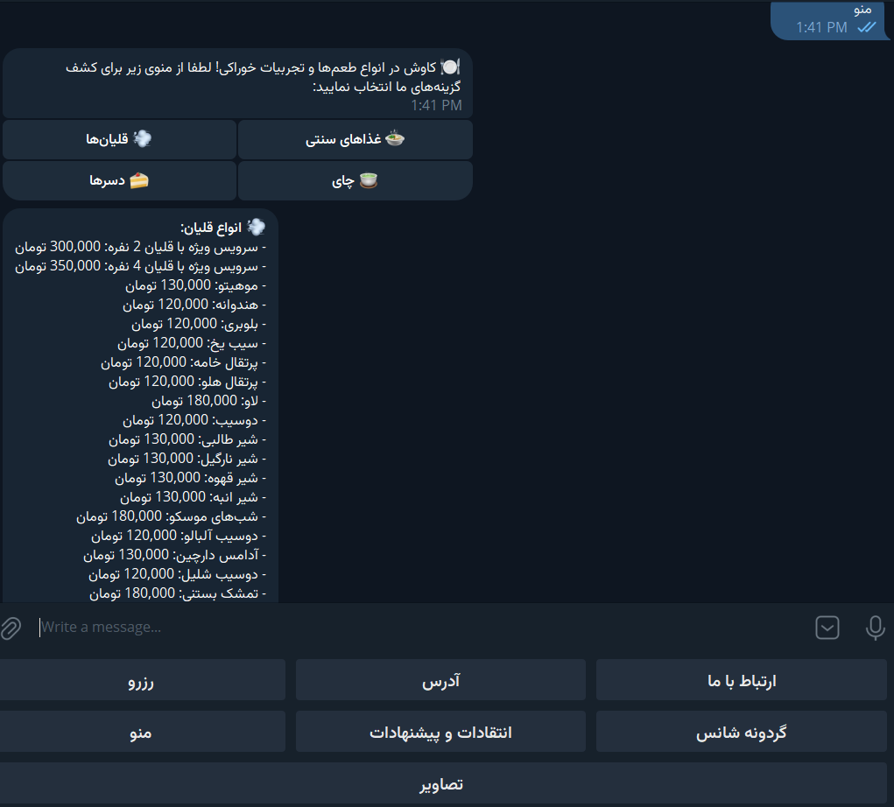

 # Telegram Bot Project

A Telegram bot designed for simple uses, including reserving turns, spinning a wheel of fortune, sharing images, providing criticism and suggestions, contact information, and location sharing via Google Maps.

## Table of Contents

- [About the Project](#about-the-project)
- [Features](#features)
- [Getting Started](#getting-started)
  - [Prerequisites](#prerequisites)
  - [Installation](#installation)

## About the Project

This Telegram bot is built using the Telebot library and is designed to handle various simple tasks. It is useful for users who need a versatile bot for reservations, entertainment, feedback, and more.

## Features

- **Reserve Turn**: Allows users to reserve their turn for various services.
- **Wheel of Fortune**: A fun feature where users can spin a wheel of fortune.
- **Images**: Users can share images through the bot.
- **Criticism and Suggestion**: Users can provide feedback and suggestions.
- **Contact Us**: Provides contact information for users.
- **Location**: Shares the location using Google Maps.

## Getting Started

To get a local copy up and running follow these simple steps.

### Prerequisites

Make sure you have Python installed on your machine. You can download it from [python.org](https://www.python.org/).

### Installation

1. Clone the repo
   ```sh

   https://github.com/ali-derogar/RestoBot.git
   ```
<br>

### Requisites
<br>

All the required libraries are in the requirement.txt file. Proceed as follows.


  ```sh
  pip install -r requirement
  ```

<br>
<!-- USAGE -->
## Usage

  ```python
  python main.py
  ```

<!-- Hints -->
## Hints


*
*
*
*


